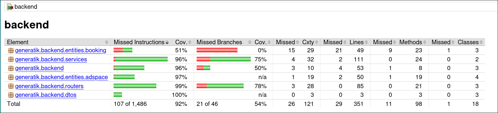

# Assessment for Generatik Junior Software Engineer  

## Demo video - assets/filmareGeneratik.mp4


## How to run ?

### 1) Docker

```
cd backend
./run-docker.sh 
```

### 2) Backend

### Testing + coverage - this is for my setup (instead of firefox you can use any other browser or use an IDE to open the coverage file)

```
cd backend
./mvnw clean test
firefox ./target/site/jacoco/index.html
```

### If all tests passed (I am 100% sure that they do) then run the backend

```
cd backend
./mvnw spring-boot:run
```

### 3) Frontend - another terminal needed

```
cd frontend
npm install
npm start
```

# Things I took into consideration

### Backend

- [x] designed and implemented jpa entities as specified in the pdf, with proper annotations, validations and inlcuded audit field as in **1.1.**
- [x] implemented RESTful principles as in **1.2.**
- [x] tests using *@SpringBootTest* and *@MockMvc* that include happy scenarios, failure, and status transitions as in **1.3**
- [x] covered edge cases as in **1.3**
- [x] *I know that is not that required* **but** the overall coverage 

### Frontend React + TypeScript + MUI components + zod rules + zustand

- [x] **AdSpaceList** that uses *MUI components* has *delete & edit* actions, uses the **api** from *adSpace.ts*, *state in zustand*, form validation **zod rules** as in **2.1.**
- [x] **BookingRequestForm** that opens when clicked "Book Now", shows the **details**, has *form fields*, and validates input **client-side** as in **2.2.**
- [x] **BookingList** displays all booking *requests*, shows **Approve/Reject** buttons as in **2.3.**
- [x] I tried to match the **theme** with the actual website

### Given more time *maybe* I would clean up or refactor

## Useful links

- [Starter spring boot backend](https://start.spring.io/)
- **Edge cases** in *./backend/EdgeCases.md*

### Structure explained

```
❯ tree .
.
├── Assesment.pdf
├── backend
│   ├── EdgeCases.md  -> edge cases that I thinked of 
│   ├── mvnw          -> executable
│   ├── mvnw.cmd
│   ├── pom.xml       -> maven dependencies + plugins
│   ├── run-docker.sh -> script for docker interaction
│   └── src           -> source code of the backend
│       ├── main
│       │   ├── java
│       │   │   └── generatik
│       │   │       └── backend
│       │   │           ├── BackendApplication.java -> seed function most important 
│       │   │           ├── CorsConfig.java         -> CORS for frontend
│       │   │           ├── dtos                    -> dtos so i don't expose the actual entities 
│       │   │           │   ├── AdSpaceDTO.java
│       │   │           │   ├── BookingCreationDTO.java
│       │   │           │   └── BookingDTO.java
│       │   │           ├── entities               -> entities using jakarta 
│       │   │           │   ├── adspace
│       │   │           │   │   ├── AdSpace.java
│       │   │           │   │   ├── AdSpaceType.java
│       │   │           │   │   ├── AvailabilityStatus.java
│       │   │           │   │   └── City.java
│       │   │           │   └── booking
│       │   │           │       ├── Booking.java
│       │   │           │       ├── BookingValidator.java
│       │   │           │       ├── ConsistentDateParameters.java
│       │   │           │       ├── ConsistentDateParameterValidator.java
│       │   │           │       └── Status.java
│       │   │           ├── repos
│       │   │           │   ├── AdSpaceRepository.java
│       │   │           │   └── BookingRepository.java
│       │   │           ├── routers                                       -> endpoints
│       │   │           │   ├── AdSpaceController.java
│       │   │           │   ├── BookingController.java
│       │   │           │   └── GlobalExceptionHandler.java
│       │   │           └── services
│       │   │               ├── AdSpaceService.java
│       │   │               └── BookingService.java
│       │   └── resources                                                 -> application configs
│       │       └── application.properties
│       └── test
│           └── java
│               └── generatik
│                   └── backend                                           -> the beloved tests
│                       ├── AdSpaceControllerTest.java
│                       ├── BackendApplicationTests.java
│                       └── BookingControllerTest.java
├── frontend
│   ├── package.json       -> dependencies / scripts for running frontend
│   ├── package-lock.json
│   ├── README.md
│   ├── src                -> source code of the frontend app
│   │   ├── api            -> interactions with the backend
│   │   │   ├── adSpaceApi.ts
│   │   │   └── bookingApi.ts
│   │   ├── App.css
│   │   ├── App.test.tsx
│   │   ├── App.tsx       -> main app 
│   │   ├── components    -> all the components specified in the pdf
│   │   │   ├── AdSpaceList.tsx
│   │   │   ├── BookingList.tsx
│   │   │   ├── BookingRequestForm.tsx
│   │   │   └── EditAdSpaceDialog.tsx
│   │   ├── index.css
│   │   ├── index.tsx
│   │   ├── react-app-env.d.ts
│   │   ├── reportWebVitals.ts
│   │   ├── setupTests.ts
│   │   ├── store         -> directory used for 'zustand' state 
│   │   │   ├── useAdSpacesStore.ts
│   │   │   ├── useBookingListStore.ts
│   │   │   └── useBookingStore.ts
│   │   └── types        -> interfaces / types for the app
│   │       └── adSpace.ts
│   └── tsconfig.json
├── Jd.pdf
└── README.md
```

## Docker stuff

1) Get a shell for it

```
sudo docker exec -it postgres-challenge psql -U postgres -d postgres
```

2) Get all tables

```
\dt
```
